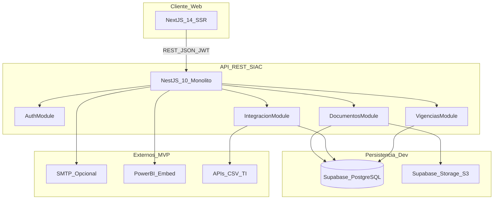

# Etapa 0 — Inception (Completada)

> **Periodo:** 20/08/2026 – 02/09/2026  
> **Estado:** Completada — retrospectivo  
> **Referencia:** [MemoriaGlobal.md](../../MemoriaGlobal.md) · [F-03 Arquitectura](../../Documentos/F-03_Arquitectura_y_diseno.docx.pdf)

## Objetivo

Alinear equipo, cliente (Planeación CUAC) y docente sobre alcance, arquitectura y plan de sprints antes del código de producción. Esta etapa define **qué** se construye y **por qué**, dejando trazabilidad para que otra persona retome el proyecto sin depender del equipo original.

## Entregables documentales

| Artefacto | Ubicación | Estado |
|-----------|-----------|--------|
| Acta de constitución (F-00) | [Documentos/F-00_Acta_de_constitucion.docx.pdf](../../Documentos/F-00_Acta_de_constitucion.docx.pdf) | ✅ |
| Propuesta técnica (F-01) | [Documentos/F-01_Propuesta_tecnica_preliminar.docx.pdf](../../Documentos/F-01_Propuesta_tecnica_preliminar.docx.pdf) | ✅ |
| Especificación de requisitos (F-02) | [Documentos/F-02_Especificacion_de_requisitos.docx-1.pdf](../../Documentos/F-02_Especificacion_de_requisitos.docx-1.pdf) | ✅ |
| Arquitectura y diseño (F-03) | [Documentos/F-03_Arquitectura_y_diseno.docx.pdf](../../Documentos/F-03_Arquitectura_y_diseno.docx.pdf) | ✅ |
| Diseño de APIs Backend | [Documentos/Diseno_APIs_SIAC.docx.pdf](../../Documentos/Diseno_APIs_SIAC.docx.pdf) | ✅ |
| Estructura normativa Decreto 1330 | [Documentos/estructura_decreto_etapas_documentos.md](../../Documentos/estructura_decreto_etapas_documentos.md) | ✅ |
| Información del proyecto | [Documentos/Información del Proyecto.md](../../Documentos/Información%20del%20Proyecto.md) | ✅ |
| Prototipo Next.js alta fidelidad | `Frontend/frontend/` | ✅ |
| Memoria frontend | [Frontend/MEMORIA_PROYECTO.md](../../Frontend/MEMORIA_PROYECTO.md) | ✅ |

## Diagrama de componentes (F-03 §1.1)

## Vista de despliegue (desarrollo)

| Capa | Tecnología | Notas |
|------|------------|-------|
| Frontend | Vercel / Next.js 16 | SSR por rol |
| Backend | NestJS 10 | API REST `/api/v1/` |
| Base de datos | Supabase PostgreSQL | Proyecto `Simulacion_siac` |
| Archivos | Supabase Storage | Buckets `evidencias/` y `plantillas/` |
| Correo | SMTP institucional | Opcional (ADR-006) |

> **Producción institucional:** PostgreSQL on-premise + MinIO en Docker (fuera del alcance de esta etapa).

## Historias de usuario — alcance del semestre

| ID | Historia | Sprint / Etapa |
|----|----------|----------------|
| HU-001 | Inicio de sesión JWT | Etapa 1 |
| HU-002 | Pantalla de inicio por rol | Etapa 1 |
| HU-003 | Carga de evidencias con metadatos | Etapa 1–2 |
| HU-004 | CRUD de evidencias | Etapa 2 |
| HU-005 | Biblioteca y CRUD de plantillas | Etapa 2 |
| HU-006 | Aprobar o rechazar evidencias | Etapa 3 |
| HU-007 | Semáforo de vigencias y alertas | Etapa 3 |
| HU-008 | Búsqueda y filtros en URL | Etapa 2 |
| HU-009 | Métricas embebidas Power BI | Etapa 3 |
| HU-010 | Panel de programas | Etapa 2 |
| HU-011 | Roles y permisos | Etapa 1 |

## ADRs registradas (F-03 §8)

| ADR | Decisión | Estado |
|-----|----------|--------|
| ADR-001 | Monolito en capas con API REST (NestJS + Next.js) | Aceptada |
| ADR-002 | PostgreSQL metadatos + Storage S3 (Supabase dev / MinIO prod) | Aceptada |
| ADR-003 | JWT con roles; OAuth Google como mejora futura | Aceptada |
| ADR-004 | Metadatos CNA textuales en Evidencia (periodo, factor, indicador) | Aceptada |
| ADR-005 | Copia local sincronizable de maestros TI + dominio operativo SIAC | Aceptada |
| ADR-006 | Alertas in-app obligatorias; SMTP opcional | Aceptada |

## Not List (alcance congelado)

- Sin integración SACES por API (radicación manual)
- Sin aplicación móvil nativa (web responsive)
- Sin microservicios
- Sin encuestas institucionales
- Sin Docker/MinIO en desarrollo (Supabase es el entorno dev)

## Convención API adoptada

Contrato oficial según **F-03 en español**: `/api/v1/evidencias`, `/api/v1/programas`, etc. El documento Diseno_APIs_SIAC aporta funcionalidades (parseo Excel, URLs firmadas, embed token) mapeadas a rutas españolas equivalentes.

## Checklist de validación

- [x] Problemática y justificación documentadas
- [x] Arquitectura monolito en capas definida
- [x] Stack acordado (Supabase PG + Storage, Prisma, JWT)
- [x] Modelo de datos F-03 documentado
- [x] Prototipo UI validable con stakeholders
- [x] Not List congelada
- [x] Cronograma 4 sprints + cierre definido

## Próxima etapa

→ [Etapa 1 — Fundación técnica](../etapa-1/README.md): Supabase + NestJS + Auth JWT + primer upload de evidencias
